# HorasPRO

> Sistema de control de rentabilidad para pequeñas agencias y profesionales freelance.
>
> **Proyecto Intermodular DAW** — IES Francisco de los Ríos, Fernán Núñez, Córdoba
>
> **Autor:** Manuel Laguna Prieto · **Entrega:** Mayo 2026

---

## Diario de desarrollo

### Sesión 1 — 1-18 de marzo de 2026

#### 1. Comprobación de herramientas

Se verificó que el equipo (Mac M4) tenía todo lo necesario instalado:

- **Git** → `git --version` → v2.50.1
- **Node.js** → ya instalado
- **Docker Desktop** → ya instalado
- **VS Code / Cursor** → ya instalado

```console
$ git --version
git version 2.50.1
$ node -v
v24.12.0
```

#### 2. Creación del repositorio

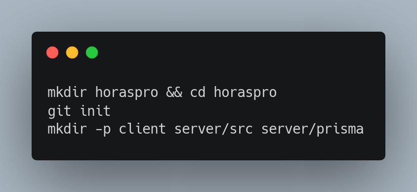

Se creó la carpeta del proyecto dentro de `~/Desktop/Proyecto 2GS/` y se inicializó el repositorio Git con la estructura básica: `client/`, `server/src/`, `server/prisma/`.

```text
horaspro/
├── client/
│   ├── public/
│   ├── src/
│   ├── package.json
│   └── vite.config.ts
├── server/
│   ├── prisma/
│   │   ├── schema.prisma
│   │   └── seed.ts
│   ├── src/
│   │   ├── controllers/
│   │   ├── middleware/
│   │   ├── routes/
│   │   └── server.ts
│   ├── .env
│   ├── package.json
│   ├── prisma.config.ts
│   └── tsconfig.json
├── docker-compose.yml
└── READMEdocumentacion.md
```

#### 3. PostgreSQL con Docker

Se creó `docker-compose.yml` en la raíz del proyecto para levantar PostgreSQL 16:

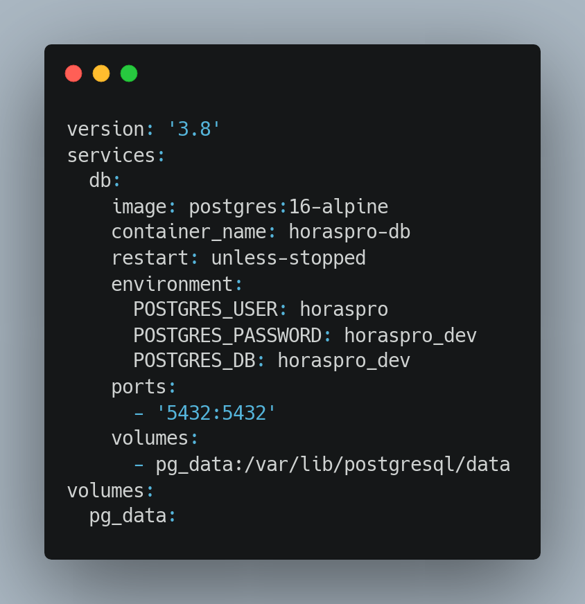

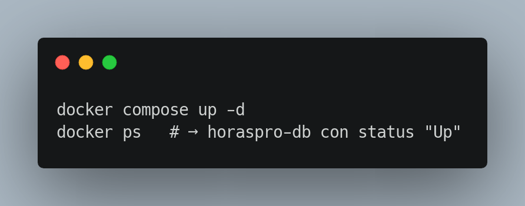

```console
$ docker ps
CONTAINER ID   IMAGE                COMMAND                  CREATED         STATUS         PORTS                    NAMES
8f9e1a2b3c4d   postgres:16-alpine   "docker-entrypoint.s…"   10 minutes ago  Up 10 minutes  0.0.0.0:5432->5432/tcp   horaspro-db
```

#### 4. Inicialización del backend

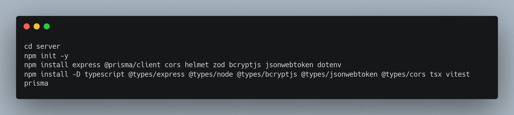

Dependencias instaladas:

| Tipo    | Paquetes                                                                   |
| ------- | -------------------------------------------------------------------------- |
| Runtime | express, @prisma/client, cors, helmet, zod, bcryptjs, jsonwebtoken, dotenv |
| Dev     | typescript, @types/\*, tsx, vitest, prisma                                 |

#### 5. Configuración de TypeScript

Se creó `server/tsconfig.json`:

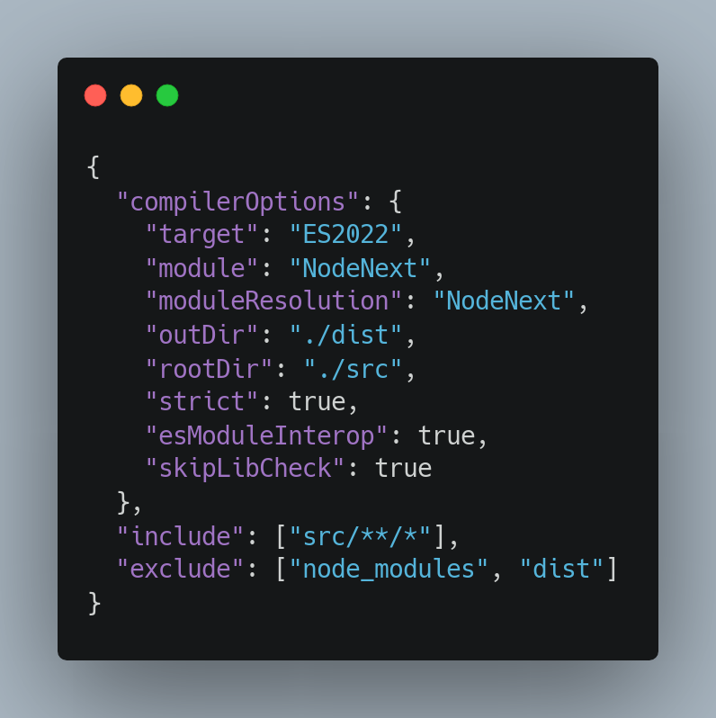

#### 6. Inicialización de Prisma

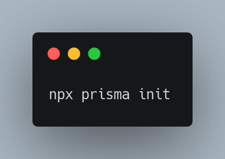

Esto generó:

- `prisma/schema.prisma` — schema de la base de datos
- `prisma.config.ts` — configuración de Prisma 7 (la URL de la BD se define aquí)
- `.env` — variables de entorno
- `.gitignore` — excluye node_modules, .env y el cliente generado

**Nota:** Prisma 7 ya no soporta `url = env("DATABASE_URL")` directamente en el schema. La conexión se configura en `prisma.config.ts`:

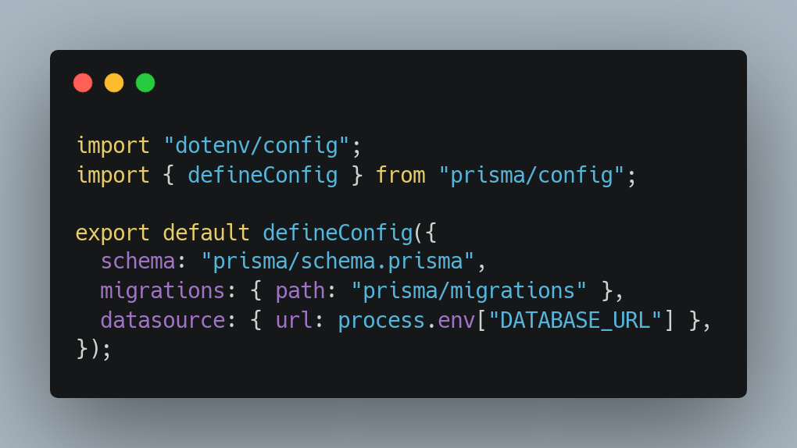

#### 7. Schema de Prisma

Se escribió el schema completo con 7 modelos y 4 enums en `prisma/schema.prisma`:

| Modelo           | Descripción                                     |
| ---------------- | ------------------------------------------------ |
| `Tenant`       | Negocio/empresa (multi-tenant)                   |
| `User`         | Usuario con rol (OWNER, ADMIN, EMPLOYEE, VIEWER) |
| `Project`      | Proyecto con cliente, presupuesto y estado       |
| `TimeEntry`    | Registro de horas trabajadas                     |
| `FixedCost`    | Costes fijos (alquiler, licencias...)            |
| `VariableCost` | Costes variables por proyecto                    |

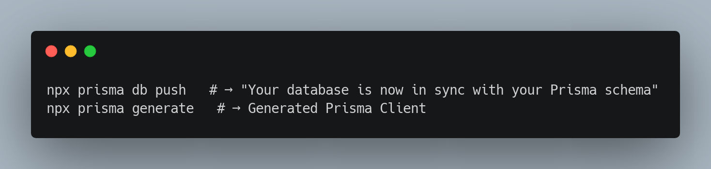

```console
$ npx prisma db push
Environment variables loaded from .env
Prisma schema loaded from prisma/schema.prisma
Datasource "db": PostgreSQL database "horaspro_dev", schema "public" at "localhost:5432"

🚀  Your database is now in sync with your Prisma schema. Done in 184ms
```

#### 8. Variables de entorno

Se configuró `server/.env`:

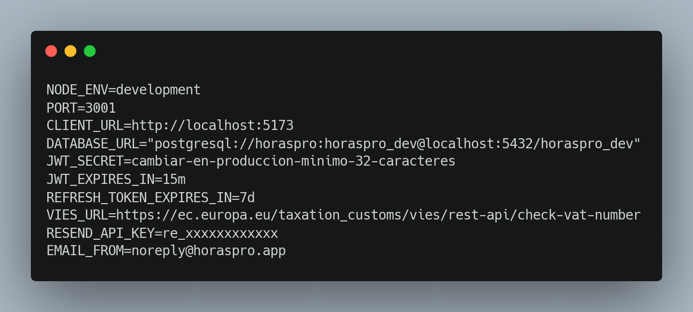

También se creó `.env.example` en la raíz del proyecto (sin secretos) para que cualquiera pueda configurar su entorno.

#### 9. Estructura de carpetas del servidor

Se crearon todos los archivos esqueleto con `// TODO` indicando qué implementar en cada uno:

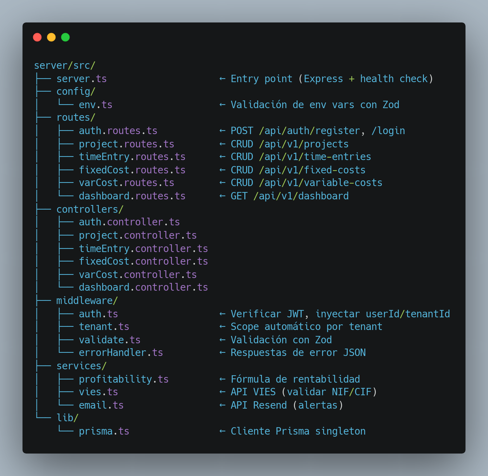

#### 10. Scripts de npm

Se configuraron los scripts en `server/package.json`:

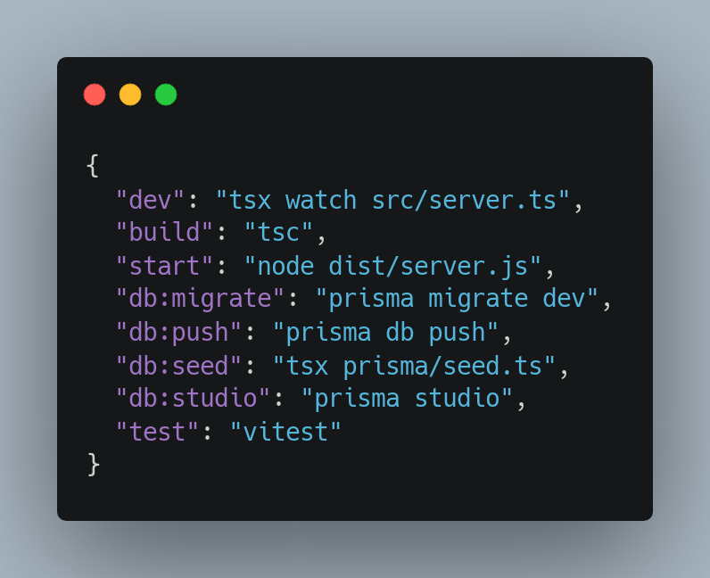

#### 11. Verificación del servidor

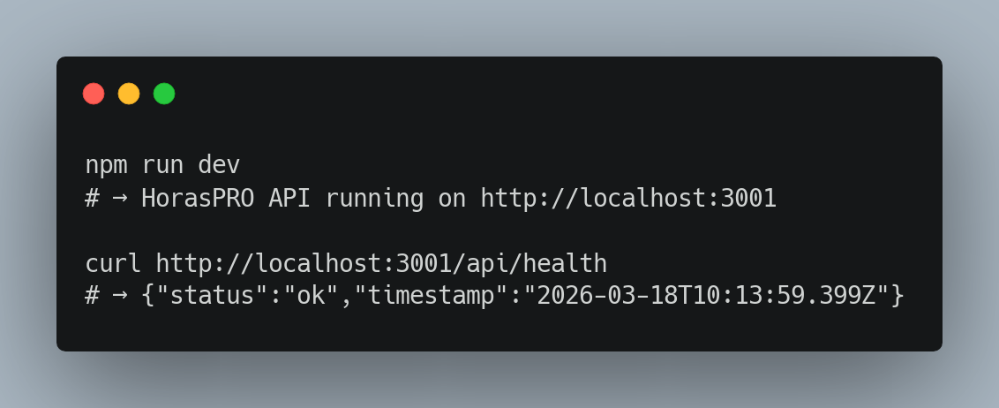

El servidor arranca correctamente y responde al endpoint de health check.

```console
$ npm run dev
> horaspro-server@0.1.0 dev
> tsx watch src/server.ts

HorasPRO API running on http://localhost:3001

# En otra terminal:
$ curl http://localhost:3001/api/health
{"status":"ok","timestamp":"2026-03-19T13:45:12.345Z"}
```

---

### Sesión 2 — 15-19 de marzo de 2026

#### 1. Validación de variables de entorno

Se creó `server/src/config/env.ts` para validar las variables de entorno al arrancar con Zod. Si falta alguna variable obligatoria (como `DATABASE_URL` o `JWT_SECRET`), el servidor no arranca y muestra un error claro:

```typescript
const envSchema = z.object({
  NODE_ENV: z.enum(["development", "production", "test"]).default("development"),
  PORT: z.coerce.number().default(3001),
  CLIENT_URL: z.string().default("http://localhost:5173"),
  DATABASE_URL: z.string(),
  JWT_SECRET: z.string().min(16),
  JWT_EXPIRES_IN: z.string().default("15m"),
  REFRESH_TOKEN_EXPIRES_IN: z.string().default("7d"),
});
```

#### 2. Middleware de errores

Se implementó `middleware/errorHandler.ts` con una clase `AppError` que permite lanzar errores con código HTTP desde cualquier punto del código:

```typescript
throw new AppError(404, "Coste fijo no encontrado");
// → responde { "error": "Coste fijo no encontrado" } con status 404
```

El middleware captura todos los errores y devuelve siempre JSON limpio. Los errores no controlados devuelven un 500 genérico sin exponer detalles internos.

#### 3. Middleware de validación con Zod

Se creó `middleware/validate.ts`, un middleware reutilizable que valida `req.body` contra un schema Zod antes de llegar al controller:

```typescript
router.post("/register", validate(registerSchema), register);
```

Si los datos no pasan la validación, responde con 400 y los detalles del error.

#### 4. Middleware de autenticación JWT

Se implementó `middleware/auth.ts` con dos funciones:

- **`requireAuth`** — Verifica el token JWT del header `Authorization: Bearer <token>`, decodifica el payload e inyecta `userId`, `tenantId` y `role` en `req.user`.
- **`requireRole(...roles)`** — Middleware adicional que comprueba que el usuario tiene uno de los roles permitidos.

```typescript
// Ejemplo de uso en rutas protegidas
router.use(requireAuth);                        // todas las rutas requieren JWT
router.delete("/:id", requireRole("OWNER", "ADMIN"), deleteProject);  // solo OWNER o ADMIN
```

#### 5. Middleware de tenant

Se creó `middleware/tenant.ts` con `tenantScope`, que verifica que el usuario autenticado tenga un `tenantId` válido. Todos los controllers usan `req.user!.tenantId` para filtrar datos, garantizando que un tenant nunca vea datos de otro.

#### 6. Autenticación completa

Se implementó `controllers/auth.controller.ts` y `routes/auth.routes.ts`:

| Endpoint                    | Descripción                                         |
| --------------------------- | ---------------------------------------------------- |
| `POST /api/auth/register` | Crea un nuevo tenant + usuario OWNER                 |
| `POST /api/auth/login`    | Verifica credenciales y devuelve tokens JWT          |
| `POST /api/auth/refresh`  | Renueva el access token con un refresh token válido |

**Flujo de registro:**

1. Valida los datos con Zod (nombre empresa, slug, email, contraseña, nombre completo)
2. Comprueba que el slug no esté en uso
3. Hashea la contraseña con bcrypt (12 rondas)
4. Crea el tenant y el usuario OWNER en una sola transacción de Prisma
5. Devuelve los datos del usuario + tokens JWT

**Flujo de login:**

1. Busca el tenant por slug
2. Busca el usuario por email dentro de ese tenant
3. Compara la contraseña con bcrypt
4. Devuelve los datos del usuario + tokens JWT (access + refresh)

#### 7. CRUD de costes fijos

Se implementó el primer módulo CRUD completo: `controllers/fixedCost.controller.ts` y `routes/fixedCost.routes.ts`.

| Endpoint                    | Método    | Descripción                   |
| --------------------------- | ---------- | ------------------------------ |
| `/api/v1/fixed-costs`     | `GET`    | Listar costes fijos del tenant |
| `/api/v1/fixed-costs`     | `POST`   | Crear un coste fijo            |
| `/api/v1/fixed-costs/:id` | `PATCH`  | Actualizar un coste fijo       |
| `/api/v1/fixed-costs/:id` | `DELETE` | Eliminar un coste fijo         |

Todas las rutas están protegidas con `requireAuth`. Cada operación filtra por `tenantId` para garantizar el aislamiento multi-tenant.

Validación con Zod en creación:

```typescript
const createFixedCostSchema = z.object({
  name: z.string().min(2),
  amount: z.number().positive(),
  frequency: z.enum(["MONTHLY", "QUARTERLY", "YEARLY"]),
  category: z.string().optional(),
});
```

#### 8. Conexión de rutas en el servidor

Se actualizó `server.ts` para registrar las rutas implementadas y añadir el `errorHandler` como último middleware:

```typescript
app.use("/api/auth", authRoutes);
app.use("/api/v1/fixed-costs", fixedCostRoutes);
app.use(errorHandler);
```

---

### Sesión 3 — 20-23 de marzo de 2026

#### 1. CRUD de Proyectos

Se implementó el módulo completo de gestión de proyectos en `controllers/project.controller.ts` y `routes/project.routes.ts`:

| Endpoint                 | Método    | Descripción                         |
| ------------------------ | ---------- | ------------------------------------ |
| `/api/v1/projects`     | `GET`    | Listar proyectos (filtro por status) |
| `/api/v1/projects`     | `POST`   | Crear un proyecto                    |
| `/api/v1/projects/:id` | `GET`    | Detalle con time entries y costes    |
| `/api/v1/projects/:id` | `PATCH`  | Actualizar un proyecto               |
| `/api/v1/projects/:id` | `DELETE` | Soft delete (marca como CANCELLED)   |

El endpoint de detalle (`GET /:id`) incluye las relaciones: devuelve las entradas de tiempo con el nombre y coste/hora del empleado, y los costes variables asociados. Esto permite al frontend calcular y mostrar la rentabilidad del proyecto.

El delete es un **soft delete**: en lugar de eliminar el registro, cambia el estado a `CANCELLED`. Así se conserva el historial para informes.

Validación con Zod en creación:

```typescript
const createProjectSchema = z.object({
  name: z.string().min(2),
  clientName: z.string().optional(),
  clientTaxId: z.string().optional(),
  description: z.string().optional(),
  status: z.enum(["DRAFT", "ACTIVE", "PAUSED", "COMPLETED", "CANCELLED"]).optional(),
  budgetHours: z.number().positive().optional(),
  budgetAmount: z.number().positive().optional(),
  startDate: z.string().optional(),
  endDate: z.string().optional(),
});
```

#### 2. CRUD de Time Entries (Registro de horas)

Se implementó el módulo de fichaje de horas en `controllers/timeEntry.controller.ts` y `routes/timeEntry.routes.ts`:

| Endpoint                     | Método   | Descripción                                        |
| ---------------------------- | --------- | --------------------------------------------------- |
| `/api/v1/time-entries`     | `GET`   | Listar horas (filtro por proyecto, usuario, fechas) |
| `/api/v1/time-entries`     | `POST`  | Registrar horas                                     |
| `/api/v1/time-entries/:id` | `PATCH` | Editar entrada de tiempo                            |

Características implementadas:

- **Cálculo automático de duración**: si se envían `startedAt` y `endedAt` sin `durationMin`, se calcula automáticamente la diferencia en minutos.
- **Filtros en listado**: por `projectId`, `userId`, y rango de fechas (`from`/`to`).
- **Validación de proyecto**: al crear una entrada, se verifica que el proyecto existe y pertenece al tenant.
- **Asignación automática de usuario**: la entrada se asocia al usuario autenticado (`req.user.userId`).

```typescript
const createTimeEntrySchema = z.object({
  projectId: z.string().uuid(),
  description: z.string().optional(),
  startedAt: z.string(),
  endedAt: z.string().optional(),
  durationMin: z.number().int().positive().optional(),
  isBillable: z.boolean().optional(),
});
```

#### 3. CRUD de Costes Variables

Se implementó el módulo de costes variables en `controllers/varCost.controller.ts` y `routes/varCost.routes.ts`:

| Endpoint                   | Método  | Descripción                                  |
| -------------------------- | -------- | --------------------------------------------- |
| `/api/v1/variable-costs` | `GET`  | Listar costes variables (filtro por proyecto) |
| `/api/v1/variable-costs` | `POST` | Crear un coste variable                       |

Los costes variables se pueden asociar opcionalmente a un proyecto. Al crear uno, se valida que el proyecto existe y pertenece al tenant. El listado incluye el nombre del proyecto asociado.

#### 4. Conexión de rutas en el servidor

Se actualizó `server.ts` para registrar las tres nuevas rutas:

```typescript
app.use("/api/v1/projects", projectRoutes);
app.use("/api/v1/time-entries", timeEntryRoutes);
app.use("/api/v1/variable-costs", varCostRoutes);
```

---

### Sesión 4 — Finalización de Backend y base de Frontend 9 Abril

#### 1. Servicios auxiliares (Mocks)

Se implementaron los servicios para VIES (`services/vies.ts`) y Resend para los correos electrónicos (`services/email.ts`). Actualmente ambas implementaciones son mocks preparadas para integrar las APIs reales más adelante.

#### 2. Dashboard y Rentabilidad

Se implementó la lógica principal en `services/profitability.ts` y el endpoint `GET /api/v1/dashboard` en `controllers/dashboard.controller.ts`.
El dashboard agrupa datos de:

- Proyectos activos
- Costes fijos del tenant
- Total de entradas de tiempo
- Total de costes variables
  Y con ello se calcula el margen neto de rentabilidad tanto para la empresa global, como individual por proyectos.

#### 3. Frontend Base

Se inicializó el cliente del frontend con Vite (`npm create vite@latest`) y React + TypeScript en la carpeta `client/`, marcando el inicio del desarrollo visual del proyecto.

### Sesión 5 — Abril 2026

#### 1. Desarrollo completo del Frontend
Se ha desarrollado todo el frontend con React y TailwindCSS. La aplicación ahora cuenta con una interfaz premium ("Clean & Premium"), completamente responsiva (mobile-first) con navegación adaptativa (barra inferior tipo iOS en móviles y barra lateral en escritorio) y soporte para Dark/Light mode implícito en la pureza del diseño actual.

#### 2. Componentes UI Reutilizables y Adaptativos
Se construyeron componentes UI base (Card, Button, Input, Modal). Los modales son ahora adaptativos: en escritorio son un panel lateral deslizante y en móvil un "bottom sheet" que asciende desde abajo, con "safe areas" y handle típicos de iOS, mejorando inmensamente la experiencia de usuario móvil.

#### 3. Dashboard y Vistas Completas
- **Dashboard**: Muestra rentabilidad en tiempo real. En escritorio con vista tabular y gráfica; en móvil apilado en tarjetas con indicadores visuales semafóricos ("Verde", "Naranja", "Rojo").
- **Costes y Proyectos**: Interfaces de gestión con diseño fluido, modales para creación/edición, y listas optimizadas. Se implementó un padding consistente y adaptativo entre dispositivos.
- **Registro de horas**: temporizador interactivo en primera pantalla con animaciones de "pulsación" y listado de horas.
- **Ajustes y Guía Interactiva**: Se diseñó una experiencia de "Guía de uso" estilo Apple con formato acordeón para reducir fricción en nuevos usuarios y explicar los conceptos del sistema.

### Sesión 6 — 10-19 Abril 2026

#### 1. Sistema de Notificaciones (Toast)
Se implementó un sistema de notificaciones global (`ToastProvider`) con soporte para tres tipos: `success`, `error` e `info`. Las notificaciones aparecen en la esquina superior derecha con animación fade-up y se auto-descartan a los 4 segundos. Se reemplazaron todos los `alert()` y componentes Toast inline por el sistema global.

#### 2. Componentes UI adicionales
- **Textarea**: Componente con label flotante consistente con Input, para textos largos (descripciones de proyecto).
- **ConfirmDialog**: Diálogo de confirmación estilo Apple que reemplaza `window.confirm()` en todas las acciones destructivas (eliminar costes, cancelar proyectos, borrar entradas).
- **EmptyState**: Componente reutilizable para estados vacíos con icono, título, descripción y acción opcional.

#### 3. Filtros avanzados en Horas
Se añadieron filtros por proyecto, rango de fechas (desde/hasta) y un resumen del filtro con total de entradas y duración. Las entradas se agrupan ahora por fecha con totales diarios visibles.

#### 4. Vista de detalle de proyecto
Nueva página `/proyectos/:id` con:
- KPIs del proyecto (horas, coste directo, costes variables, margen neto)
- Barra de progreso de horas consumidas vs. presupuestadas
- Pestañas: Resumen financiero, Historial de horas, Costes variables
- Desglose financiero completo con barra de rentabilidad
- Exportación CSV por pestaña

Las cards de proyectos en la vista principal ahora navegan al detalle al hacer click.

#### 5. Módulo de Informes
Nueva sección "Informes" (`/informes`) accesible desde sidebar y navegación móvil:
- Filtros por período: semana actual, mes actual, trimestre actual
- KPIs: horas totales, porcentaje facturable, media diaria, costes fijos
- Gráfico de barras horizontal de distribución de horas por proyecto
- Gráfico de barras vertical de distribución semanal (lunes a domingo)
- Resumen de costes fijos + variables con tarifa mínima recomendada

#### 6. Dashboard enriquecido
Se añadieron dos secciones nuevas al dashboard:
- **Acciones rápidas**: enlaces directos a fichar horas, crear proyecto y ver informes
- **Actividad reciente**: últimas 5 entradas de tiempo con proyecto, duración y fecha

#### 7. Exportación CSV
Utilidad genérica `exportCsv()` con BOM UTF-8 y separador `;` para compatibilidad con Excel. Botones de exportación en:
- Horas (con filtros aplicados)
- Costes fijos
- Costes variables
- Detalle de proyecto (horas y costes)
- Informes

#### 8. Mejoras en API y utilidades
- `ApiError`: Error tipado con `status` y `code` para mejor manejo en el frontend
- `format.ts`: Módulo con funciones de formato reutilizables (`fmt`, `fmtDuration`, `fmtDate`, `fmtCurrency`, `toNum`, `greeting`)

#### 9. Mejoras en autenticación
- Indicador visual de fortaleza de contraseña en registro (longitud, mayúscula, número) con barra de progreso de 3 niveles
- Feedback via Toast tras login y registro exitosos

#### 10. Refactorización de Ajustes
Se migró la página de Ajustes al sistema Toast global, eliminando el componente `Toast` inline y el estado `ToastState` local tanto en `ProfileSection` como en `PasswordSection`.

---

### Estado actual

| Componente                | Estado                                            |
| ------------------------- | ------------------------------------------------- |
| Repositorio Git           | Inicializado, subido a GitHub                     |
| PostgreSQL (Docker)       | Configurado                                       |
| Schema Prisma (6 modelos) | Sincronizado con BD                               |
| Express server            | Arranca, health check OK                          |
| Autenticación JWT         | Register, login y refresh completos               |
| CRUD Endpoints            | Listos (Costes, Proyectos, Horas, Variables)      |
| Validaciones & Errors     | Middleware de Zod en toda la API                  |
| Dashboard rentabilidad    | Completo (API + Servicio + Acciones rápidas)      |
| Frontend UI               | Completado: Navegación, Dashboard, CRUDs          |
| Responsive Design         | Completado: UX Adaptativa (Bottom Sheet, etc)     |
| UX / Onboarding           | Guía interactiva completada                       |
| Detalle de proyecto       | Completo (métricas, pestañas, exportación)        |
| Informes y análisis       | Completo (productividad, distribución, costes)    |
| Exportación CSV           | Implementado en todas las vistas de datos         |
| Sistema de notificaciones | Toast global + ConfirmDialog en acciones críticas |
| Indicador contraseña      | Fortaleza visual en registro                      |

### Siguiente paso

Realizar ajustes finales, despliegue a la nube e integración con la API VIES/Resend para la versión de producción.
