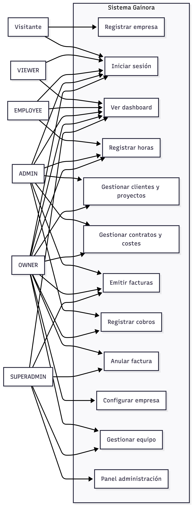
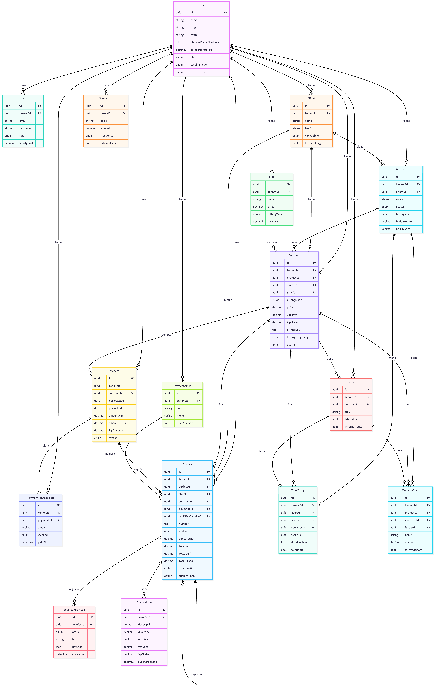
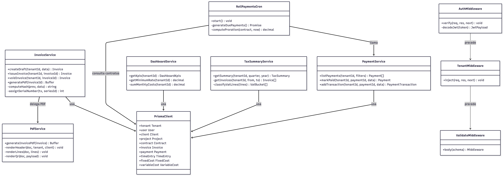

# PORTADA

---

**IES Francisco de los Ríos**
Ciclo Formativo de Grado Superior
Desarrollo de Aplicaciones Web

---

**Proyecto Intermodular**
**Gainora — Plataforma SaaS de control de rentabilidad para autónomos y agencias**

---

Autor: Manuel Laguna Prieto
Mayo, 2026

---

> **Nota de formato para la entrega final en Word:**  
> Este fichero es el borrador de contenido. Al pasar a Word aplicar: fuente Times New Roman 11 pt, interlineado 1,15 líneas, espaciado 6 pt entre párrafos, títulos tamaño 16 negrita numerados (1. 1.1. 1.2.), alineación justificada, encabezado con nombre del proyecto, pie de página con nombre del alumno y número de página. Los diagramas marcados con `[DIAGRAMA]` deben sustituirse por la imagen real generada con la herramienta indicada.

---

## Tabla de contenidos

1. Descripción del problema
2. Objetivos del proyecto
3. Recursos necesarios
   - 3.1. Recursos de desarrollo
   - 3.2. Recursos de producción
4. Planificación temporal
5. Desarrollo del proyecto
   - 5.1. Requisitos de la aplicación
   - 5.2. Diseño de la aplicación
     - 5.2.1. Diseño de la arquitectura
     - 5.2.2. Diseño de datos
   - 5.3. Codificación
   - 5.4. Pruebas
   - 5.5. Problemas encontrados
6. Manual de usuario
7. Valoraciones y conclusión
   - 7.1. Evaluación del grado de cumplimiento de los objetivos y finalidad
   - 7.2. Evaluación de la planificación temporal y de la toma de decisiones
   - 7.3. Posibles mejoras a la solución
   - 7.4. Conclusión final
8. Bibliografía
9. Anexos
   - 9.1. Código fuente de la aplicación
   - 9.2. Otros

---

## 1. Descripción del problema

España cuenta con más de 3,3 millones de trabajadores autónomos y decenas de miles de pequeñas agencias de servicios digitales (diseño, desarrollo, consultoría, marketing). La gran mayoría de estos negocios no dispone de herramientas adecuadas para conocer su rentabilidad en tiempo real.

El flujo habitual es el siguiente: el autónomo trabaja durante el año, emite facturas manualmente o con aplicaciones de facturación básica, y descubre a final del ejercicio, en la reunión con su gestor, si el año ha sido rentable o no. En ese momento ya no es posible corregir nada.

Los problemas concretos que este modelo genera son:

- El autónomo no sabe cuánto le cuesta producir una hora de trabajo, por lo que fija precios de forma intuitiva y frecuentemente por debajo del umbral de rentabilidad.
- No existe un seguimiento sistematizado de las horas dedicadas a cada cliente o proyecto, lo que impide saber si un trabajo concreto ha sido rentable.
- Las herramientas de facturación existentes no calculan rentabilidad ni ofrecen métricas de negocio.
- Las soluciones contables completas (Holded, Quipu) están diseñadas para gestores, no para el autónomo sin formación financiera, y su curva de aprendizaje es elevada.
- Las soluciones internacionales (FreshBooks, QuickBooks) no soportan las particularidades fiscales españolas: retención de IRPF, recargo de equivalencia ni la nueva normativa VeriFactu (Real Decreto 1007/2023).

El proyecto Gainora da solución a este problema mediante una aplicación web SaaS que permite al autónomo o pequeña agencia conocer en tiempo real su rentabilidad, controlar sus horas y proyectos, y emitir facturas legales conforme a la normativa española vigente, sin necesidad de formación contable previa.

---

## 2. Objetivos del proyecto

Los objetivos se dividen en objetivo general y objetivos específicos. Se indica el estado de cumplimiento de cada uno al cierre del proyecto.

### 2.1. Objetivo general

Diseñar, desarrollar y desplegar una aplicación web SaaS multi-tenant que permita a un autónomo o pequeña agencia conocer en tiempo real su rentabilidad y cumplir con la normativa fiscal española de facturación.

### 2.2. Objetivos específicos

| Código | Objetivo | Estado |
|---|---|:-:|
| OE-01 | Calcular automáticamente la tarifa mínima rentable a partir de costes fijos, capacidad horaria y margen objetivo. | CUMPLIDO |
| OE-02 | Registrar horas trabajadas por proyecto, empleado e incidencia, con cronómetro integrado. | CUMPLIDO |
| OE-03 | Gestionar clientes, proyectos y contratos de servicios en modalidades fija, por hora, suscripción e híbrida. | CUMPLIDO |
| OE-04 | Generar facturas en PDF con todos los requisitos legales españoles: IVA, IRPF, recargo de equivalencia. | CUMPLIDO |
| OE-05 | Implementar cadena de integridad VeriFactu (SHA-256) conforme al RD 1007/2023. | CUMPLIDO |
| OE-06 | Sistema de roles y permisos diferenciados: OWNER, ADMIN, EMPLOYEE, VIEWER, SUPERADMIN. | CUMPLIDO |
| OE-07 | Aislar los datos de cada empresa mediante arquitectura multi-tenant. | CUMPLIDO |
| OE-08 | Desplegar la aplicación en producción, accesible desde Internet las 24 horas. | CUMPLIDO |
| OE-09 | Mostrar métricas de rentabilidad en tiempo real: MRR, margen bruto, proyección anual. | CUMPLIDO |
| OE-10 | Generar resumen fiscal trimestral con datos para los Modelos 303 y 130. | CUMPLIDO |

---

## 3. Recursos necesarios

### 3.1. Recursos de desarrollo

**Hardware:**
- Ordenador portátil Apple MacBook con macOS — equipo principal de desarrollo
- Navegadores para pruebas: Google Chrome, Safari, Firefox

**Software:**
- **Visual Studio Code** — editor de código principal
- **Node.js 22** — entorno de ejecución JavaScript/TypeScript en backend
- **Docker Desktop** — ejecución de PostgreSQL en contenedor local durante el desarrollo
- **Git + GitHub** — control de versiones y repositorio remoto
- **Postman** — pruebas manuales de endpoints de la API
- **Prisma Studio** — exploración visual de la base de datos en desarrollo
- **npm** — gestión de dependencias en ambos proyectos (cliente y servidor)
- **Vite** — servidor de desarrollo del frontend con HMR (Hot Module Replacement)
- **tsx** — ejecución de TypeScript en Node.js sin compilación previa, para desarrollo del backend
- **Claude Code** — asistente de desarrollo con IA, utilizado para implementación, revisión de código y depuración

### 3.2. Recursos de producción

**Infraestructura:**
- **Railway** — plataforma de despliegue en la nube para el servidor Node.js y la base de datos PostgreSQL. Gestiona contenedores Docker de forma automatizada.
- **Vercel** — plataforma CDN global para el frontend React. Despliegue continuo desde GitHub.
- **GitHub** — repositorio del código fuente. Actúa como origen del despliegue continuo para Railway y Vercel.
- **Certificados TLS/SSL** — gestionados automáticamente por Railway y Vercel, proporcionando HTTPS en ambos servicios.

**Software en producción:**
- **Node.js 22** — servidor de aplicaciones Express
- **PostgreSQL 17** — base de datos relacional gestionada por Railway
- **Prisma 7** — ORM para la conexión a la base de datos
- **PDFKit** — generación de documentos PDF en el servidor

---

## 4. Planificación temporal

El proyecto se desarrolló a lo largo de aproximadamente 14 semanas, desde el inicio de la segunda evaluación. A continuación se muestra la planificación por semanas, con indicación de lo que estaba previsto y lo que finalmente se ejecutó.

| Semana | Fechas aprox. | Planificado | Realizado | Desviación |
|---|---|---|---|---|
| S01 | 3–9 feb | Anteproyecto y definición de requisitos | Anteproyecto entregado | Ninguna |
| S02 | 10–16 feb | Diseño de la base de datos y schema Prisma | Schema inicial completo | Ninguna |
| S03 | 17–23 feb | Autenticación JWT, registro y login | Auth completa con refresh token | +2 días (refresh token más complejo) |
| S04 | 24 feb–2 mar | CRUD de clientes y proyectos | CRUD completo + validación Zod | Ninguna |
| S05 | 3–9 mar | Registro de horas (TimeEntries) | Horas + cronómetro | +1 día (cronómetro) |
| S06 | 10–16 mar | Costes fijos y variables | Costes + cálculo tarifa mínima | Ninguna |
| S07 | 17–23 mar | Contratos y suscripciones | Contratos con todos los modos de facturación | +3 días (lógica de prorrateo) |
| S08 | 24–30 mar | Cron de pagos periódicos | Cron funcional a las 03:00 | Ninguna |
| S09 | 31 mar–6 abr | Sistema de facturación básico | Facturación con PDF y hash VeriFactu | +4 días (VeriFactu más complejo) |
| S10 | 7–13 abr | Roles y permisos | Sistema de roles 5 niveles | Ninguna |
| S11 | 14–20 abr | Dashboard y métricas | Dashboard completo + resumen fiscal 303/130 | +1 día |
| S12 | 21–27 abr | QA y corrección de bugs | QA intensivo, 8 bugs corregidos | Ninguna |
| S13 | 28 abr–4 may | Despliegue en producción (Railway + Vercel) | Despliegue completo y funcional | Ninguna |
| S14 | 5–15 may | Documentación final | Documentación completa | En curso |

**Valoración de la planificación:** Las semanas S03 (refresh token), S07 (prorrateo de suscripciones) y S09 (VeriFactu) sufrieron desviaciones de entre 1 y 4 días porque la complejidad técnica fue mayor de la estimada. En ningún caso supuso retraso en el objetivo final gracias a que las semanas anteriores habían terminado antes de lo previsto.

---

## 5. Desarrollo del proyecto

### 5.1. Requisitos de la aplicación

Se describen a continuación los requisitos funcionales y no funcionales de la solución técnica.

#### Requisitos funcionales

**RF-01 — Registro de empresa:** el sistema permite crear una empresa con nombre, slug único, email de administrador y contraseña. Genera automáticamente el tenant y el usuario OWNER.

**RF-02 — Autenticación:** el sistema autentica a los usuarios mediante email y contraseña. Emite un access token (15 minutos) y un refresh token (7 días). El auto-renovación es transparente para el usuario.

**RF-03 — Gestión de clientes:** el usuario puede crear, editar, consultar y eliminar clientes. Cada cliente tiene datos de contacto, NIF/CIF, régimen fiscal (nacional, UE, tercero) y configuración de recargo de equivalencia.

**RF-04 — Gestión de proyectos:** los proyectos se asocian a un cliente y pueden tener estado (borrador, activo, pausado, completado, cancelado) y modalidad de facturación.

**RF-05 — Gestión de contratos:** cada proyecto puede tener uno o varios contratos. Un contrato define las condiciones económicas del servicio: precio, modo de facturación (fijo, por hora, suscripción, híbrido), IVA, IRPF, día de facturación y frecuencia.

**RF-06 — Registro de horas:** el usuario registra entradas de tiempo con proyecto, descripción y duración. Dispone de cronómetro integrado. Las horas se asocian al contrato y pueden marcarse como facturables o no facturables.

**RF-07 — Costes fijos:** el usuario registra los gastos fijos mensuales, trimestrales o anuales del negocio (alquiler, software, sueldos). El sistema los mensualiza para el cálculo de la tarifa.

**RF-08 — Costes variables:** el usuario registra gastos específicos de un proyecto o incidencia (materiales, desplazamientos, subcontrataciones) con soporte de IVA y marcado de bien de inversión.

**RF-09 — Generación automática de pagos:** el sistema genera automáticamente cada noche los cobros periódicos de los contratos de suscripción, calculando prorrateo para periodos incompletos.

**RF-10 — Facturación:** el usuario genera borradores de factura vinculados a un pago. Al emitir, la factura recibe número correlativo de su serie, se calcula el hash SHA-256 VeriFactu, y se genera el PDF legal.

**RF-11 — Factura rectificativa:** la anulación de una factura emitida genera automáticamente una factura rectificativa en serie R, que referencia a la original.

**RF-12 — Dashboard:** el panel principal muestra MRR, ingresos del mes en curso, margen bruto, tarifa mínima rentable y proyección de ingresos anuales con sparklines de evolución.

**RF-13 — Informes:** la sección de informes muestra la evolución mensual de ingresos, costes y margen, con filtros por periodo.

**RF-14 — Resumen fiscal:** el sistema calcula las casillas del Modelo 303 (IVA) y Modelo 130 (IRPF) para cada trimestre, con soporte de criterio de devengo o criterio de caja.

**RF-15 — Roles y permisos:** el sistema controla el acceso por rol (SUPERADMIN, OWNER, ADMIN, EMPLOYEE, VIEWER). Cada acción sensible está protegida tanto en frontend como en backend.

**RF-16 — Onboarding:** el nuevo usuario es guiado por un asistente paso a paso en su primer acceso, que configura la empresa, el primer cliente, el primer proyecto y los costes básicos.

**RF-17 — Centro de ayuda:** la aplicación dispone de una sección /ayuda con artículos de soporte y un botón flotante de ayuda contextual en cada pantalla.

#### Requisitos no funcionales

**RNF-01 — Seguridad:** las contraseñas se almacenan con bcrypt (10 rounds). El aislamiento entre empresas se garantiza mediante tenantId en cada consulta. Los tokens JWT se verifican en cada petición.

**RNF-02 — Integridad de facturas:** las facturas emitidas no pueden modificarse. La cadena de hashes SHA-256 (VeriFactu) permite detectar cualquier alteración retroactiva.

**RNF-03 — Disponibilidad:** la aplicación está disponible las 24 horas con despliegue continuo desde GitHub, sin tiempos de inactividad gracias al rolling deployment de Railway y Vercel.

**RNF-04 — Rendimiento:** las operaciones normales responden en menos de 1 segundo gracias a índices compuestos en las columnas de mayor consulta (tenantId+status, projectId, clientId, contractId).

**RNF-05 — Usabilidad:** el diseño es responsivo (sidebar en escritorio, navegación inferior en móvil). El onboarding permite configurar el sistema desde cero en menos de 60 segundos.

**RNF-06 — Cumplimiento legal:** las facturas cumplen los requisitos de la Ley 37/1992 del IVA y del Real Decreto 1007/2023 (VeriFactu): numeración correlativa, campos obligatorios, cadena de hashes, QR de verificación.

### 5.2. Diseño de la aplicación

#### 5.2.1. Diseño de la arquitectura

La arquitectura del sistema sigue el patrón de **tres capas**:

```
┌─────────────────────────────────────────┐
│           CAPA DE PRESENTACIÓN          │
│     React 19 + TypeScript + Vite        │
│          Tailwind CSS 4                 │
│      Desplegado en Vercel (CDN)         │
└──────────────────┬──────────────────────┘
                   │ HTTPS · JSON · REST
                   ▼
┌─────────────────────────────────────────┐
│           CAPA DE LÓGICA                │
│     Node.js 22 + Express 5              │
│           TypeScript 5.9                │
│  Middleware: JWT · tenant · Zod         │
│  Servicios: facturación · cron · PDF    │
│   Desplegado en Railway (contenedor)    │
└──────────────────┬──────────────────────┘
                   │ TCP / TLS
                   ▼
┌─────────────────────────────────────────┐
│           CAPA DE DATOS                 │
│         PostgreSQL 17                   │
│         Prisma 7 (ORM)                  │
│    Gestionado por Railway               │
└─────────────────────────────────────────┘
```

La **capa de presentación** (frontend) es una SPA (Single Page Application) que se carga una sola vez en el navegador y actualiza el contenido de forma dinámica mediante peticiones a la API, sin recargas de página completa.

La **capa de lógica** (backend) expone una API REST. Todas las peticiones pasan por una cadena de middlewares: verificación de identidad (JWT), extracción del tenant, validación del cuerpo de la petición (Zod). La lógica de negocio reside en servicios independientes del protocolo HTTP.

La **capa de datos** es una base de datos relacional PostgreSQL accedida exclusivamente a través de Prisma ORM, que garantiza type-safety y gestiona las migraciones de schema.

La comunicación entre capas se realiza siempre mediante HTTPS con certificados TLS emitidos por las plataformas de despliegue (Vercel y Railway).

**Diagrama de Casos de Uso:**

*

Los actores del sistema son: **Visitante** (no autenticado), **VIEWER**, **EMPLOYEE**, **ADMIN**, **OWNER** y **SUPERADMIN**.

Casos de uso principales por actor:

| Actor | Casos de uso |
|---|---|
| Visitante | Consultar landing · Registrar empresa · Iniciar sesión |
| VIEWER | Ver dashboard · Ver proyectos · Ver facturas · Ver informes |
| EMPLOYEE | Todo lo de VIEWER + Registrar horas propias · Ver horas propias |
| ADMIN | Todo lo de EMPLOYEE + Crear/editar clientes y proyectos · Gestionar costes · Crear contratos · Emitir facturas · Registrar cobros |
| OWNER | Todo lo de ADMIN + Anular facturas · Configurar empresa · Gestionar equipo · Ver resumen fiscal |
| SUPERADMIN | Todo lo anterior en todos los tenants + Acceso al panel de administración |

#### 5.2.2. Diseño de datos

El modelo de datos se diseñó con Prisma Schema Language y genera la base de datos relacional PostgreSQL. La entidad central es **Tenant** (empresa), a la que pertenecen todos los demás datos del sistema.

**Diagrama Entidad-Relación:**

*

Las entidades y sus relaciones principales son:

**Tenant** — empresa cliente de Gainora.
- Atributos clave: `id` (UUID), `name`, `slug`, `plan`, `plannedCapacityHours`, `targetMarginPct`, `costingMode`, `taxCriterion`.
- Relaciones 1:N con todas las demás entidades del sistema.

**User** — usuario del sistema perteneciente a un Tenant.
- Atributos clave: `tenantId`, `email`, `passwordHash`, `fullName`, `role`, `hourlyCost`.
- Restricción: `UNIQUE(tenantId, email)` — el mismo email puede existir en distintos tenants.

**Client** — cliente de la empresa.
- Atributos clave: `tenantId`, `name`, `taxId`, `taxRegime`, `hasSurcharge`.
- `taxRegime` determina el IVA aplicable: NATIONAL (21%), EU_INTRA (0% intracomunitario), NON_EU (0% exportación).

**Project** — proyecto asociado a un cliente.
- Atributos clave: `clientId`, `billingMode`, `budgetHours`, `budgetAmount`, `hourlyRate`.

**Contract** — condiciones económicas de un proyecto. Unidad de facturación.
- Atributos clave: `projectId`, `clientId`, `billingMode`, `price`, `vatRate`, `irpfRate`, `billingDay`, `billingFrequency`.
- Relaciones N:1 con Plan (catálogo) y 1:N con Payment, TimeEntry, VariableCost, Issue, Invoice.

**Plan** — catálogo de planes de servicio reutilizables.

**Payment** — cobro periódico generado por el cron.
- Atributos clave: `contractId`, `periodStart`, `periodEnd`, `amountNet`, `amountGross`, `irpfAmount`, `status`.

**PaymentTransaction** — registro de abonos parciales de un pago.

**InvoiceSeries** — serie de numeración (A: general, R: rectificativas, F: simplificadas).
- `nextNumber` se incrementa atómicamente al emitir cada factura.

**Invoice** — documento fiscal legal.
- Atributos clave: `seriesId`, `number`, `status`, `clientId`, `subtotalNet`, `totalVat`, `totalIrpf`, `totalGross`, `previousHash`, `currentHash`, `qrPayload`.
- `number` es null mientras la factura está en estado DRAFT; se asigna al emitir y es inmutable.

**InvoiceLine** — línea de detalle de la factura con cantidad, precio unitario, IVA, IRPF y recargo.

**InvoiceAuditLog** — log insert-only de eventos sobre facturas (ISSUE, VOID, RECTIFY). Implementa la trazabilidad requerida por VeriFactu.

**TimeEntry** — entrada de tiempo de un usuario en un proyecto.
**FixedCost** — gasto fijo del negocio.
**VariableCost** — gasto variable de un proyecto o incidencia.
**Issue** — incidencia/ticket de soporte vinculado a un contrato.

### 5.3. Codificación

#### Tecnologías y frameworks utilizados

| Componente | Tecnología | Versión | Justificación |
|---|---|---|---|
| Frontend — framework | React | 19 | Estándar de la industria. Modelo de componentes, Virtual DOM, ecosistema. |
| Frontend — tipado | TypeScript | 5.9 | Detección de errores en compilación. Type-safety end-to-end. |
| Frontend — bundler | Vite | 6 | Compilación en < 1s en desarrollo. Build optimizado con code-splitting. |
| Frontend — estilos | Tailwind CSS | 4 | Utility-first. Dark mode nativo. Sin CSS personalizado. |
| Frontend — routing | React Router | 7 | Routing declarativo con rutas protegidas. |
| Backend — runtime | Node.js | 22 | JavaScript en ambos lados del stack. |
| Backend — framework | Express | 5 | Middleware nativo async/await. Sin callbacks. |
| Backend — tipado | TypeScript | 5.9 | Mismo lenguaje que el frontend. |
| ORM | Prisma | 7 | Modelos type-safe. Migraciones versionadas. Prisma Studio. |
| Base de datos | PostgreSQL | 17 | Estándar relacional. Soporte de UUID, JSONB, transacciones ACID. |
| Autenticación | JWT + bcryptjs | — | Tokens sin estado (stateless). Escalable horizontalmente. |
| Validación | Zod | 4 | Schemas tipados compartibles. Validación declarativa. |
| PDF | PDFKit | 0.18 | Generación de PDF programática sin headless Chrome. |
| QR | qrcode | 1.5 | Generación del QR de verificación VeriFactu en el PDF. |
| Cron | node-cron | 4 | Tareas programadas con expresión cron estándar. |
| Testing | Vitest | 4 | Compatible con TypeScript sin configuración adicional. |
| Contenedores | Docker | — | PostgreSQL en contenedor local durante el desarrollo. |
| CI/CD frontend | Vercel | — | Despliegue automático desde GitHub. CDN global. |
| CI/CD backend | Railway | — | Despliegue automático desde GitHub. PostgreSQL gestionado. |

#### Estructura de directorios

```
horaspro/
├── client/                      ← Proyecto frontend (React + Vite)
│   ├── src/
│   │   ├── pages/               ← Una pantalla por archivo (DashboardPage, InvoicesPage…)
│   │   ├── components/
│   │   │   ├── ui/              ← Componentes reutilizables: Button, Modal, Input, Toast…
│   │   │   ├── layout/          ← AppLayout, Sidebar, BottomNav, FloatingHelpButton
│   │   │   ├── contracts/       ← Componentes de dominio: ContractsTab, IssuesPanel…
│   │   │   └── reports/         ← TaxSummarySection
│   │   ├── context/             ← AuthContext, ThemeContext, OnboardingContext
│   │   ├── hooks/               ← useCan (permisos)
│   │   ├── lib/
│   │   │   ├── api.ts           ← Cliente HTTP con auto-refresh de token
│   │   │   ├── permissions.ts   ← Matriz de permisos por rol
│   │   │   └── format.ts        ← Formatters de moneda, fecha y duración
│   │   └── router/              ← Definición de rutas con rutas protegidas
│   ├── vite.config.ts
│   ├── vercel.json              ← Configuración de redirecciones para SPA
│   └── package.json
│
├── server/                      ← Proyecto backend (Node.js + Express)
│   ├── src/
│   │   ├── server.ts            ← Entry point: Express app, middlewares, arranque
│   │   ├── routes/              ← Endpoints REST por recurso (invoice.routes.ts…)
│   │   ├── middleware/
│   │   │   ├── auth.ts          ← Verificación JWT, inyección de userId y role
│   │   │   ├── tenant.ts        ← Inyección de tenantId en el contexto de la petición
│   │   │   ├── validate.ts      ← Validación del body con Zod
│   │   │   └── errorHandler.ts  ← Manejo centralizado de errores
│   │   ├── services/            ← Lógica de negocio desacoplada de HTTP
│   │   ├── jobs/
│   │   │   └── rollPaymentsCron.ts ← Tarea programada de pagos nocturnos
│   │   ├── lib/
│   │   │   ├── prisma.ts        ← Instancia singleton de PrismaClient
│   │   │   └── permissions.ts   ← Constantes de permisos por rol
│   │   └── config/
│   │       └── env.ts           ← Validación de variables de entorno al arrancar
│   ├── prisma/
│   │   └── schema.prisma        ← Definición de todas las tablas y relaciones
│   └── package.json
│
└── docker-compose.yml           ← PostgreSQL en contenedor para desarrollo local
```

#### Algoritmos y protocolos relevantes

**Protocolo HTTP REST:** la API sigue las convenciones REST. Los métodos HTTP indican la operación: GET (leer), POST (crear), PUT/PATCH (actualizar), DELETE (eliminar). Las rutas nombran el recurso: `/api/v1/clients`, `/api/v1/invoices/:id`. Los códigos de estado HTTP indican el resultado: 200 (éxito), 201 (creado), 400 (petición inválida), 401 (no autenticado), 403 (sin permiso), 404 (no encontrado), 409 (conflicto).

**Algoritmo de autenticación JWT:** al hacer login se generan dos tokens firmados con HMAC-SHA256. El access token lleva `{ userId, tenantId, role, exp }` y expira en 15 minutos. El refresh token lleva solo `{ userId }` y expira en 7 días. El cliente detecta si el access token expira en los próximos 15 segundos y lo renueva automáticamente usando el refresh token.

**Algoritmo de hash VeriFactu:** al emitir una factura se calcula:
`currentHash = SHA256(seriesId + número + fecha + totalGross + previousHash)`
donde `previousHash` es el `currentHash` de la última factura emitida de la misma serie (o la constante `"GENESIS"` si es la primera). La cadena resultante hace imposible modificar o eliminar facturas retroactivamente sin romper la secuencia.

**Algoritmo de generación de pagos periódicos (cron):** cada noche a las 03:00, el proceso revisa todos los contratos activos con facturación periódica. Para cada contrato calcula si corresponde generar un nuevo pago según `billingDay` y `billingFrequency`. Si el contrato empezó a mitad de periodo, el importe se calcula proporcionalmente: `importe = precio × (días del periodo / días totales del mes)`.

**Diagrama de Clases:**

*

Las clases/módulos principales del backend son:

- `InvoiceService` — lógica de emisión, anulación y generación de rectificativas.
- `PaymentService` — lógica de cobros parciales y totales.
- `RollPaymentsCron` — generación automática de pagos periódicos.
- `DashboardService` — cálculo de KPIs y tarifa mínima.
- `TaxSummaryService` — cálculo de casillas Modelo 303/130.
- `PdfService` — generación de PDFs con PDFKit.

#### Seguridad frente a inyección SQL

El acceso a la base de datos se realiza exclusivamente mediante Prisma ORM con consultas parametrizadas. No se construyen cadenas SQL manualmente en ningún punto del código. Esto elimina la posibilidad de inyección SQL. En los dos casos donde se usa SQL nativo (`$queryRaw`), se emplean template literals de Prisma que parametrizan automáticamente los valores.

### 5.4. Pruebas

#### Pruebas unitarias automatizadas

Se implementaron tests con Vitest para los servicios de lógica crítica. Las pruebas verifican el comportamiento correcto y los casos límite de:

- **InvoiceService:** generación correcta del hash SHA-256, numeración correlativa sin huecos, creación automática de rectificativas.
- **RateService (tarifa mínima):** cálculo con modo de costeo por absorción y por contribución, con distintas capacidades y márgenes.
- **RollPaymentsCron:** generación de pagos mensuales, trimestrales y anuales; cálculo de prorrateo para contratos iniciados a mitad de periodo.

#### Pruebas funcionales manuales

Se realizaron sesiones de QA guiadas por checklist, verificando los flujos completos de la aplicación con las cinco cuentas de usuario:

| Bloque | Escenarios verificados | Resultado |
|---|---|---|
| CP-01: Autenticación | Login · registro · logout · sesión expirada · auto-refresh | OK |
| CP-02: Onboarding | Wizard completo desde cuenta recién creada | OK |
| CP-03: Clientes | Alta · edición · borrado · validaciones de formulario | OK |
| CP-04: Proyectos y contratos | CRUD completo · todos los modos de facturación | OK |
| CP-05: Horas | Registro manual · cronómetro · edición · filtros | OK |
| CP-06: Costes | Costes fijos y variables · cálculo de tarifa | OK |
| CP-07: Facturación | Draft → Emit → PDF → Void → Rectificativa | OK |
| CP-08: Roles | Verificación de permisos con los 5 roles | OK |
| CP-09: Informes | Dashboard · evolución · resumen fiscal 303/130 | OK |

#### Pruebas de seguridad

- Verificación de que un usuario de un tenant no puede acceder a datos de otro tenant modificando el ID en la URL.
- Verificación de que un usuario con rol EMPLOYEE no puede emitir facturas aunque envíe la petición directamente a la API.
- Verificación de que los tokens JWT caducados son rechazados correctamente.

### 5.5. Problemas encontrados

**Problema 1 — Numeración correlativa con concurrencia**
Al emitir dos facturas simultáneamente, ambas podrían leer el mismo `nextNumber` y generar dos facturas con el mismo número, lo que vulneraría la normativa. Solución: se utiliza `SELECT ... FOR UPDATE` en PostgreSQL para bloquear la fila de `InvoiceSeries` durante la transacción de emisión. El segundo proceso espera a que el primero libere el bloqueo.

**Problema 2 — Prorrateo de suscripciones en periodos incompletos**
Un contrato iniciado el día 15 de febrero solo debía facturar la mitad del mes, no el mes completo. El cron inicial no tenía esta lógica. Solución: se implementó el cálculo `precio × (días de cobertura / días totales del periodo)` en el servicio de generación de pagos.

**Problema 3 — CORS en producción**
En desarrollo el frontend y el backend corren en el mismo equipo. En producción son dominios distintos (Vercel y Railway), por lo que el navegador bloqueaba las peticiones por política de CORS. Solución: configuración explícita de los dominios permitidos en el middleware `cors()` del servidor, con variables de entorno para no hardcodear las URLs.

**Problema 4 — Referencia circular en Prisma con `rectifiesInvoiceId`**
La relación autorreferencial de `Invoice` (una factura puede rectificar a otra de la misma entidad) generaba un error de tipos en TypeScript al incluir las relaciones en la query. Solución: uso de `select` explícito en lugar de `include` para romper la circularidad, seleccionando solo los campos necesarios de la factura rectificada.

**Problema 5 — Generación de PDF con caracteres especiales**
PDFKit no renderizaba correctamente tildes ni eñes al usar la fuente por defecto. Solución: carga de una fuente TTF (Helvetica embebida de PDFKit) con soporte completo de UTF-8.

---

## 6. Manual de usuario

### 6.1. Crear una cuenta

1. Acceder a la URL de producción: https://client-five-ebon-83.vercel.app
2. Hacer clic en **"Empieza gratis"** o ir a `/register`.
3. Introducir el nombre de la empresa, el email y una contraseña.
4. Hacer clic en **"Crear cuenta"**. Se iniciará sesión automáticamente y comenzará el asistente de configuración.

### 6.2. Asistente de configuración inicial (Onboarding)

El asistente guía en 5 pasos al completar el registro por primera vez:

- **Paso 1 — Tu empresa:** nombre fiscal, NIF/CIF y datos de contacto.
- **Paso 2 — Tu capacidad:** horas mensuales disponibles y margen de beneficio objetivo.
- **Paso 3 — Primer cliente:** nombre y datos básicos del primer cliente.
- **Paso 4 — Primer proyecto:** nombre del proyecto asociado al cliente anterior.
- **Paso 5 — Costes básicos:** un primer coste fijo (p. ej., cuota de autónomo) para que la tarifa mínima tenga sentido desde el primer momento.

### 6.3. Registrar horas trabajadas

1. En el menú lateral, seleccionar **"Horas"**.
2. Hacer clic en **"Nueva entrada"**.
3. Seleccionar el proyecto, escribir una descripción y la duración (horas:minutos) o pulsar el botón de cronómetro para medir en tiempo real.
4. Hacer clic en **"Guardar"**.

### 6.4. Emitir una factura

1. En el menú lateral, seleccionar **"Cobros"**.
2. Localizar el pago pendiente del mes y hacer clic en él.
3. Hacer clic en **"Crear borrador de factura"**.
4. Revisar las líneas, fechas e importes. Hacer clic en **"Emitir factura"**.
5. El sistema asigna el número correlativo, calcula el hash VeriFactu y genera el PDF.
6. Hacer clic en **"Descargar PDF"** para obtener el documento listo para enviar al cliente.

### 6.5. Ver la rentabilidad del negocio

1. En el menú lateral, seleccionar **"Dashboard"**.
2. La pantalla principal muestra:
   - **Tarifa mínima rentable:** el precio mínimo por hora para cubrir costes y margen objetivo.
   - **MRR:** ingresos recurrentes del mes actual.
   - **Margen bruto:** porcentaje de beneficio sobre los ingresos.
   - **Proyección anual:** estimación de ingresos al final del año.
3. El gráfico de evolución muestra los últimos 6 meses de ingresos y costes.

### 6.6. Gestionar el equipo

1. En el menú lateral, seleccionar **"Ajustes"** → **"Equipo"**.
2. Hacer clic en **"Invitar usuario"**.
3. Introducir el email y seleccionar el rol (ADMIN, EMPLOYEE o VIEWER).
4. El usuario puede hacer login con ese email inmediatamente.

### 6.7. Consultar el resumen fiscal trimestral

1. En el menú lateral, seleccionar **"Informes"**.
2. Hacer clic en la pestaña **"Resumen fiscal"**.
3. Seleccionar el trimestre y el año.
4. El sistema muestra las casillas relevantes del Modelo 303 (IVA) y Modelo 130 (IRPF) calculadas a partir de las facturas del periodo.

---

## 7. Valoraciones y conclusión

### 7.1. Evaluación del grado de cumplimiento de los objetivos y finalidad

Los 10 objetivos específicos definidos al inicio del proyecto se han cumplido íntegramente. La aplicación está desplegada y accesible desde cualquier navegador, con todas las funcionalidades implementadas y probadas.

El objetivo general también se ha cumplido: Gainora es una aplicación web SaaS multi-tenant en producción que permite a un autónomo o agencia conocer su rentabilidad en tiempo real y emitir facturas legales conforme a la normativa española vigente, incluyendo la nueva normativa VeriFactu de 2026.

Adicionalmente, se implementaron funcionalidades no previstas inicialmente que mejoran la propuesta de valor del producto: el resumen fiscal trimestral (Modelos 303 y 130), el centro de ayuda con 12 artículos contextuales, el sistema de incidencias (issues) vinculado a contratos y el paleta de comandos (Command Palette) para navegación rápida.

### 7.2. Evaluación de la planificación temporal y de la toma de decisiones

La planificación inicial fue, en general, realista. Los principales desvíos se produjeron en tres semanas:

- **Semana S03 (autenticación):** la implementación del refresh token con auto-renovación transparente fue más compleja de lo estimado. Se tardaron 2 días más. Decisión tomada: se consideró que la seguridad y la experiencia de usuario sin interrupciones de sesión justificaban el sobrecoste.

- **Semana S07 (contratos):** el cálculo de prorrateo para contratos iniciados a mitad de periodo requirió diseñar un algoritmo más cuidadoso. Tardó 3 días más. Decisión tomada: no se simplificó el prorrateo (cobrando el mes completo siempre) porque habría generado facturas incorrectas.

- **Semana S09 (facturación):** la implementación de VeriFactu con transacciones atómicas y el correcto encadenamiento de hashes fue la parte técnicamente más difícil. Se tardaron 4 días más. Decisión tomada: no se redujo el alcance porque VeriFactu es obligatorio desde 2026 y es un diferenciador real del producto.

En todos los casos, las semanas que terminaron antes de lo previsto (S04, S05, S06) aportaron margen suficiente para absorber estos desvíos sin impactar la fecha de entrega.

### 7.3. Posibles mejoras a la solución

| Mejora | Prioridad | Descripción |
|---|---|---|
| Tests E2E con Playwright | Alta | Automatizar el flujo completo desde el navegador para detectar regresiones. La infraestructura existe (`client/e2e/`) pero los tests no se completaron por falta de tiempo. |
| Página de detalle de cliente | Alta | Vista completa del cliente con historial de proyectos, contratos, facturas y cobros agrupados. |
| Sección dedicada de Contratos en sidebar | Alta | Acceso directo a todos los contratos activos, independientemente del proyecto al que pertenecen. |
| `prisma migrate` en lugar de `prisma db push` | Media | Para tener un historial versionado de migraciones y permitir rollbacks controlados en producción. |
| Schemas Zod compartidos cliente-servidor | Media | Eliminar la duplicación de validaciones, moviendo los schemas a un paquete compartido. |
| Integración bancaria PSD2 | Baja | Conciliación automática de cobros con los movimientos bancarios del autónomo. |
| Exportación a SII | Baja | Declaración trimestral automática ante la AEAT. Obligatoria en el futuro para empresas medianas. |

### 7.4. Conclusión final

El proyecto Gainora ha sido el trabajo más completo y exigente del ciclo formativo. Ha requerido aplicar simultáneamente conocimientos de diseño de bases de datos relacionales, desarrollo de API REST, arquitectura de frontend moderno, seguridad web, fiscalidad española y despliegue en producción en la nube.

El resultado es una aplicación real, desplegada y funcional, no un ejercicio académico. Las decisiones técnicas tomadas (multi-tenancy, VeriFactu, generación de PDF en backend, JWT con refresh) responden a necesidades reales del dominio y están justificadas tanto técnica como legalmente.

El aprendizaje más valioso no ha sido ninguna tecnología concreta, sino la capacidad de abordar un problema complejo descomponiéndolo en capas, tomar decisiones con información incompleta y asumir deuda técnica consciente cuando el plazo lo exigía.

---

## 8. Bibliografía

- **Real Decreto 1007/2023**, de 5 de diciembre, por el que se aprueba el Reglamento que establece los requisitos que deben adoptar los sistemas y programas informáticos o electrónicos que soporten los procesos de facturación. BOE núm. 291, 6 dic. 2023. https://www.boe.es/eli/es/rd/2023/12/05/1007
- **Ley 37/1992**, de 28 de diciembre, del Impuesto sobre el Valor Añadido. BOE núm. 312.
- **React Documentation** — Guía oficial de React 19, Hooks, Context API y React Router. https://react.dev
- **Express.js Documentation** — Guía oficial de Express 5. https://expressjs.com
- **Prisma Documentation** — ORM, Schema Language, Client API y Prisma Migrate. https://www.prisma.io/docs
- **PostgreSQL Documentation 17** — Manual oficial de PostgreSQL 17. https://www.postgresql.org/docs/17/
- **JSON Web Tokens (JWT)** — RFC 7519 (Especificación del estándar). https://datatracker.ietf.org/doc/html/rfc7519
- **bcrypt** — Descripción del algoritmo de hash de contraseñas. Provos, N. & Mazières, D. (1999). *A Future-Adaptable Password Scheme*.
- **PDFKit** — Documentación de la librería de generación de PDF en Node.js. https://pdfkit.org
- **Zod Documentation** — Guía de validación de schemas TypeScript-first. https://zod.dev
- **Tailwind CSS v4** — Documentación oficial. https://tailwindcss.com/docs
- **node-cron** — Documentación de la librería de tareas programadas. https://github.com/node-cron/node-cron
- **Holded** — Referencia del estado del arte en software de gestión para pymes españolas. https://holded.com
- **Quipu** — Referencia de software de facturación para autónomos en España. https://getquipu.com
- **Vite Documentation** — Guía oficial del bundler. https://vite.dev

**Partes generadas con asistencia de Inteligencia Artificial:**

Durante el desarrollo del proyecto se utilizó **Claude Code (Anthropic)** como herramienta de asistencia para:
- Implementación de algoritmos complejos (cadena VeriFactu, cálculo de prorrateo, generación de PDF).
- Depuración de errores de tipos en TypeScript.
- Revisión de lógica de permisos y middlewares.
- Generación de la estructura inicial de esta documentación.

Todo el código generado fue revisado, adaptado y validado por el autor. La lógica de negocio, las decisiones de arquitectura y el diseño del sistema son responsabilidad del alumno.

---

## 9. Anexos

### 9.1. Código fuente de la aplicación

El código fuente completo está disponible en el repositorio de GitHub del proyecto.

URL del repositorio: *(enlace al repositorio GitHub)*

El repositorio contiene las carpetas `client/` (frontend React) y `server/` (backend Node.js + Prisma), con todos los ficheros necesarios para ejecutar la aplicación en local siguiendo las instrucciones del README del repositorio.

### 9.2. Otros

**A — Capturas de pantalla de producción**

*(Insertar capturas de: landing page, login, dashboard, tabla de facturas, PDF generado, resumen fiscal, panel de equipo)*

**B — Credenciales de la cuenta de demostración**

URL de producción: https://client-five-ebon-83.vercel.app

| Nombre | Rol | Email | Contraseña |
|---|---|---|---|
| Manuel | SUPERADMIN | manuel@lapri.app | password123 |
| Laura | OWNER | laura@lapri.app | password123 |
| Pepa | ADMIN | pepa@lapri.app | password123 |
| Juan | EMPLOYEE | juan@lapri.app | password123 |
| Cristina | VIEWER | cristina@lapri.app | password123 |

**C — Ejemplo de factura PDF generada**

La siguiente imagen muestra la factura A-1 emitida por LaPri Nexus a Empresa Demo S.L., generada por Gainora. Incluye desglose de base imponible, IVA (21%), retención IRPF (15%) y el bloque VeriFactu con QR y hash SHA-256.


**D — Variables de entorno necesarias**

Para ejecutar el proyecto en local, crear los ficheros `.env` con las variables indicadas en `.env.example`.

Variables mínimas del backend:
- `DATABASE_URL` — cadena de conexión PostgreSQL
- `JWT_SECRET` — clave de firma de tokens (mínimo 32 caracteres)
- `CLIENT_URL` — URL del frontend (para CORS)
- `PORT` — puerto del servidor (por defecto 3000)
